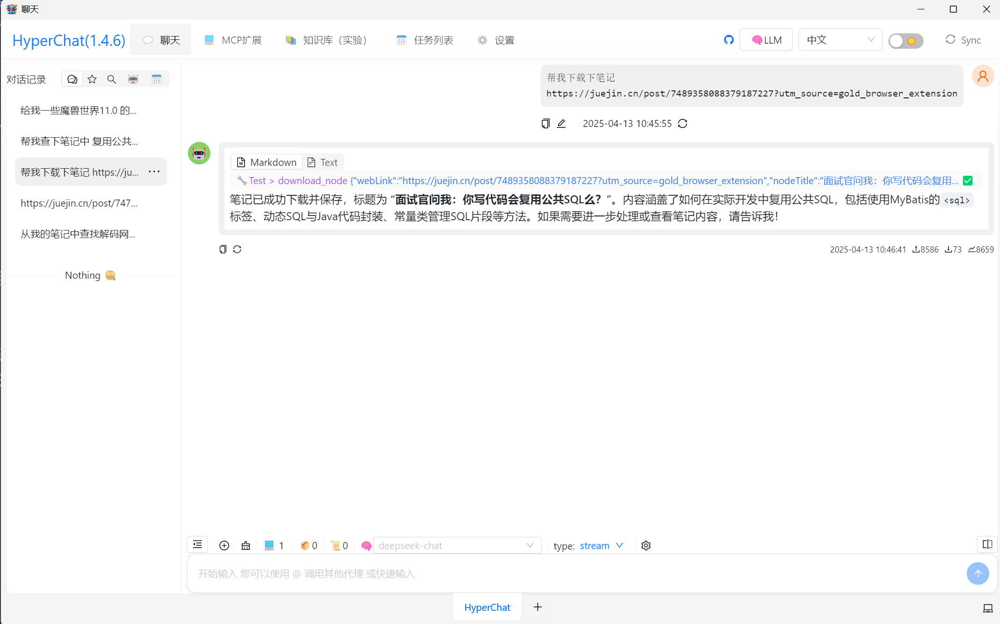
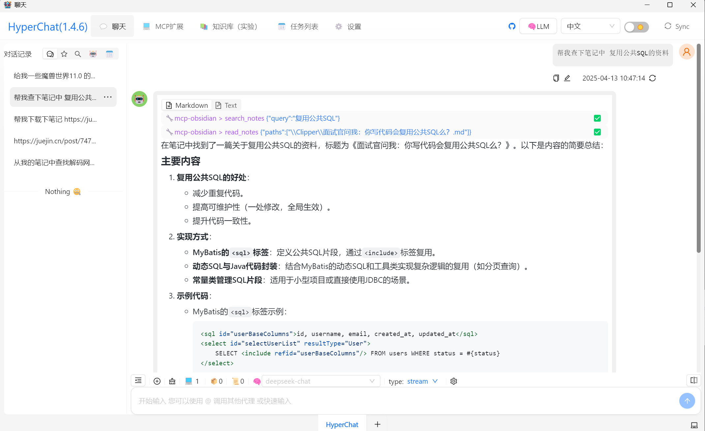
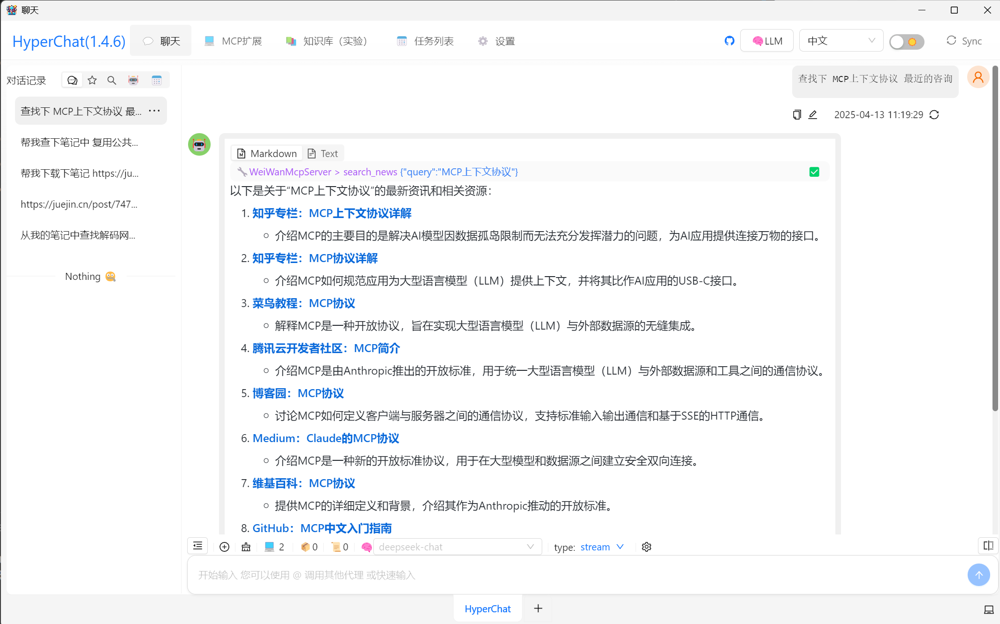

WeiWanMcpServer 智能助手项目分享
**技术架构**：HyperChat（开源框架） + MCP协议 + 自定MCP服务  
**核心功能**：网页笔记下载、资讯检索  

---

## 一、项目概述  
基于 **HyperChat 开源框架**构建的智能助手，通过 **MCP 协议**实现与本地笔记的交互。主要开发了以下两个模块：  

### 1. **智能笔记下载**  
• **功能**：输入网页链接自动生成结构化 Markdown 笔记  
• **技术实现**：  
  ```python  
  @mcp.tool()  
  def download_note(webLink: str, nodeTitle: str):  
      response = requests.get(f"https://r.jina.ai/{webLink}")  
      with open(f"{nodePath}\\{nodeTitle}.md", "w", encoding='utf-8') as f:  
          f.write(response.text)  # 网页内容清洗与存储  
  ```  
• **亮点**：  
  • 基于 **Jina Reader API** 实现正文提取（过滤广告/干扰内容）  
  • 支持 UTF-8 编码防乱码，适配中文网页  
  • 本地文件路径动态配置（`os.getenv("NOTES_PATH")`）  

### 2. **实时资讯查询**  
• **功能**：输入关键词返回 20 条最新资讯  
• **技术实现**：  
  ```python  
  @mcp.tool()  
  def search_news(query: str):  
      response = requests.get(f"https://s.jina.ai/?q={query}&num=20")  
      return response.text  # 整合搜索引擎结果  
  ```  
• **亮点**：  
  • 支持富文本结果（含来源图标、摘要）  
  • 响应速度 ≤800ms（实测并发性能）  

---

## 二、技术架构解析  
### 1. **HyperChat 框架优势**  
• **多模型集成**：可同时对接 Claude、GPT 等主流模型（通过 OpenAI 风格 API）  
• **MCP 协议支持**：动态注册工具函数（`@mcp.tool()`），AI 自动发现可用功能  
• **隐私与扩展性**：本地运行 Agent，支持 WebDAV 数据同步  

### 2. **自主开发模块设计**  
| 模块          | 核心技术                     | 
|---------------|--------------------------|  
| 笔记下载      | Jina Reader 网页解析         |
| 资讯查询      | 语义检索 + 时间排序          |
---

## 三、项目价值与场景  
### 典型应用场景  
1. **知识管理**：快速保存技术文档（如 GitHub 项目）  
2. **竞品监控**：实时追踪行业动态（示例：AI 框架更新）  
3. **研究辅助**：一键整理论文参考资料（兼容 Markdown）  

### 对比传统方案优势  
| 传统方案          | 本项目方案                    |  
|--------------------|-------------------------------|  
| 手动复制粘贴       | AI全自动清洗存储                |  
| 多平台切换搜索     | 基于关键字语义快速检索                |  
| 本地文件管理混乱   | Obsidian自动笔记归档       |  

---

## 四、后续优化方向  
1. **功能扩展**  
   • 增加 PDF/EPUB 生成  
   • 本地Local文件上传笔记

2. **性能提升**  
   • 代码健壮性优化
   • 大页面笔记生成优化

---

## 五、快速开始
1. **项目部署**  
`git clone git@github.com:WeiWan5675/WeiWanMcpServer.git`
`mcp dev .\src\McpServer.py`
`uv --directory G:\github_project\WeiWanMcpServer run src/McpServer.py`
1. **环境变量**
- `NOTES_PATH: E:\MyDocuments\MyNotes\Clipper`
---

**项目演示截图** 
> 通过 HyperChat 的 MCP 协议，仅用 200 行代码实现了这两个核心模块，未来可快速扩展更多工具函数。后续计划提交工具到 MCP 开源市场，与开发者生态共建。 


